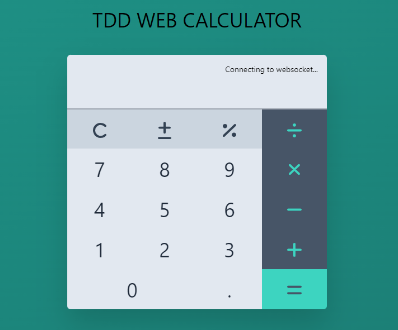

[](https://www.python.org/)
[](COPYING)

# TDD Web Calculator

🏫 For educational purposes 🏫



*Learn and practice Test Driven Development in Python to create a Web app calculator.*

This repo provides a skeleton web application of a calculator written in Python.  

It has been created using tests from the very beginning.

## Using this repo

This repository is split into 2 branches of code: `main` and `instructor`

### The main branch

The `main` branch contains a minimal set of tests and code to provide the features:

  * Initialises to 0
  * Calculations using Addition
  
It can be used as a starting point for learning and practicing TDD. 

> What features are missing?  
> ...  
> How would you go about writing a test and the code for these missing features?  
> ...  

### The instructor branch

The `instructor` branch contains an empty calculator class and no tests. In this branch you will find a guide `INSTRUCTORS_GUIDE.md` that takes you step by step through the writing of tests and code to get to the same state as the `main` branch.

It is intented to be used to show one way of practicing TDD to create an application. Showing the benefits of TDD using RED - GREEN - REFACTOR.

It can used to present to students, or followed by the students themselves.

### The Web App

To provide a visual way to interract with the `Calculator` class, a web application is provided.

It works by creating a command as a list of button presses that gets sent to the backend Python app (`Calculator.parse()`) when you press the "equals" button.

For example: [1, 2, 3, "+", 1, "="]

### The Challenge

Whether you follow the guide or start from the `main` branch we hope you find this a useful starting point that makes you think about testing differently and shows the benefits and power of testing first to lead you through your programming journey.

**Your challenge is to add the missing functionality to get this calculator working.**

## Getting Started

To start coding you will need a few basics setup first

### Development Environment

You will need the following software in order to run and develop the Python code:

Please follow the official docs for each pre-req as required on how to install for your environment.

  * [VSCode](https://code.visualstudio.com/) or another IDE of your choice
  * [Python](https://www.python.org/downloads) (with pip)
  * [Git](https://git-scm.com/download)

We then need some additional packages required for this app.

It is recommended to install python requirements inside a virtual env (See [python documentation](https://docs.python.org/3/tutorial/venv.html) for more information) but this is outside the scope of this repo.

Install the requirements:

```bash
pip install -r requirements.txt
```

### Running Locally

Once you have all the required components installed we can run the code
locally to interact with the web app.

Navigate to the repo:

```bash
cd tdd-web-calc
```

*If you are using a virtual environment remember to switch to it*

And run the local server:

```bash
python3 ./app/app.py
```

A message will show you the status of the run and a URL to see the app. [http://127.0.0.1:5000](http://127.0.0.1:5000)

*This is run in debug mode so any changes to the app will live reload the web application.*

*Note: This will not show changes to any css parameters in the html file. See [Developing the Web page](#developing-the-web-page) for more information on how to do this.*

### Running the Tests

Tests are saved under the `tests` directory

The tests for the `Calculator` class should live in the `tests/test_calculator.py` file.

To run the tests:

```bash
python3 -m pytest
```

## Developing the Web Page

*You do not need to follow this section if you only want to play with TDD for Python*

This repo is intended to aide in TDD for the Python backend app. But in the event you want to make changes to the frontend web application you can, but there are a few extra details you will need to know.

### Styling

To change the style of the web app we use [TailwindCSS](https://tailwindcss.com).

To change these styles you will need to have installed.

-   [NodeJS](https://nodejs.org/en/download/)
-   [TailwindCSS CLI](https://tailwindcss.com/docs/installation)

Once you have these installed you will need to run the following to install some more requirements:

```bash
cd tdd-web-calc
npm install
```

These extra packages allow you to recompile the `app/static/css/output.css` stylesheet that is used to style and format the web application.

To recompile the `output.css` stylesheet run:

For Windows:

```bash
npx tailwindcss -i .\src\input.css -o .\src\static\css\output.css --watch
```

For Linux:

```bash
npx tailwindcss -i ./src/input.css -o ./src/static/css/output.css --watch
```

### Web Page

The web page is a Flask template and can be found under `app/templates/index.html`.

It is a simple web page made of lots of `div`'s to make up the buttons and layout of the calculator.

Each web tag is styled using TailwindCSS in its `class` property. If you make any changes to the html classes you will need to recompile the output.css stylesheet as described in the previous sub-section.

The script components of the web page can be changed but the socketio scripts must remain in order for the web app to be able to communicate with the backend.

This is also true for the buttons of the calculator. They can be changed into anything you like but there must exist components with the same id's so that the calculator can send messages back to the backend.

Changes to the `index.html` page can be seen by reloading the web browser of a running instance.

### Javascript

The Web page functionality is provided by a simple javascript file `app/static/js/webcalc.js`.

In this you will find the functions used to monitor for button clicks and the use of socketio to send web socket messages to the backend.

Changes to this can be seen by reloading the web browser of a running instance.

License
-------

GNU General Public License v3.0 or later

See [COPYING](COPYING) to see the full text.
